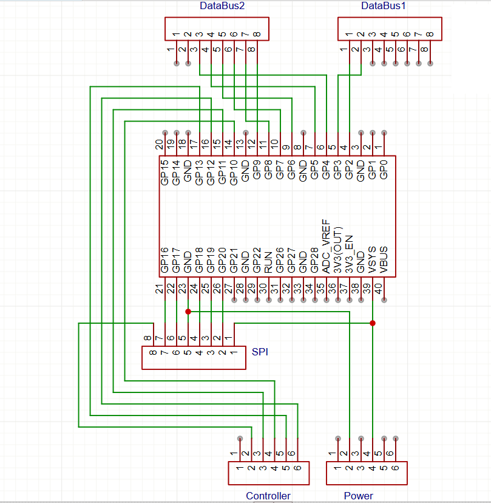

# SPI to 8-bit parallel converter

> for 3.5" TFT Display based on Raspberry Pi Pico

- 3.5" TFT Display on [Amazon](https://a.co/d/hsLOjUq)

- Patched driver for the display [repo](https://github.com/exor2008/ili9486patch)

- Device tree [config](https://github.com/exor2008/nixos-rpi-4/blob/main/system/rpi-hardware.nix) and patched driver [module](https://github.com/exor2008/nixos-rpi-4/tree/main/system/ili9486) for NixOS

- Gerber files are in the Gerber [folder](https://github.com/exor2008/ili9486-spi-to-8bit/Gerber)
- Schematics:

